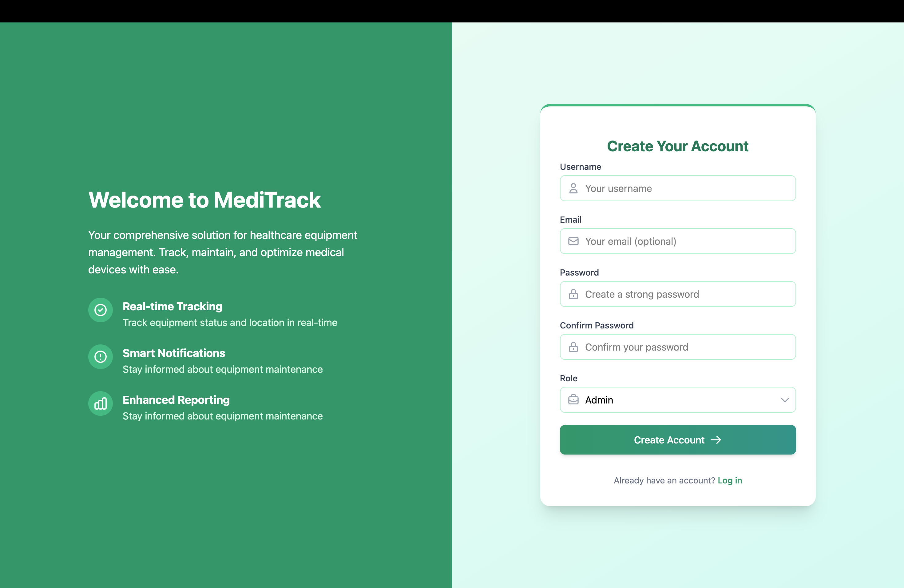
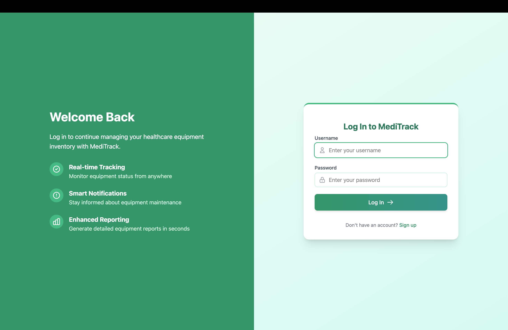
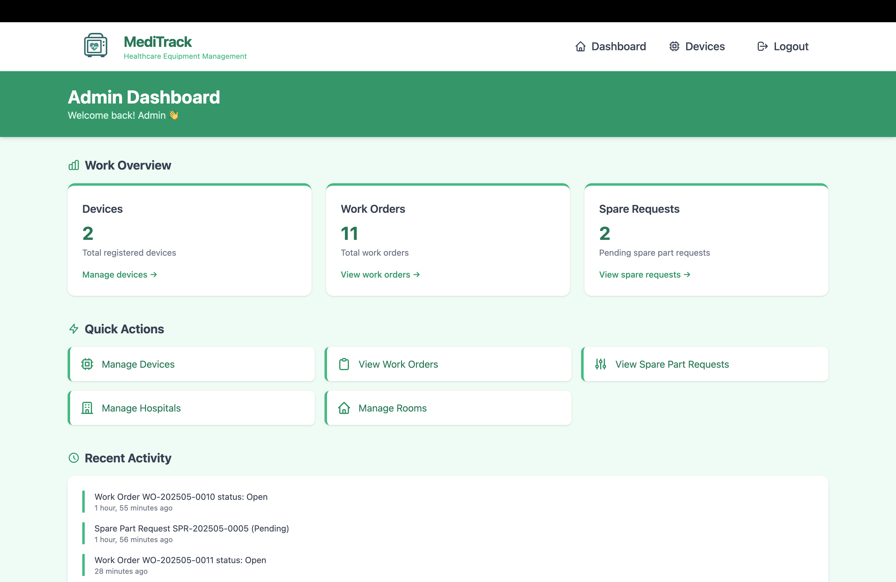
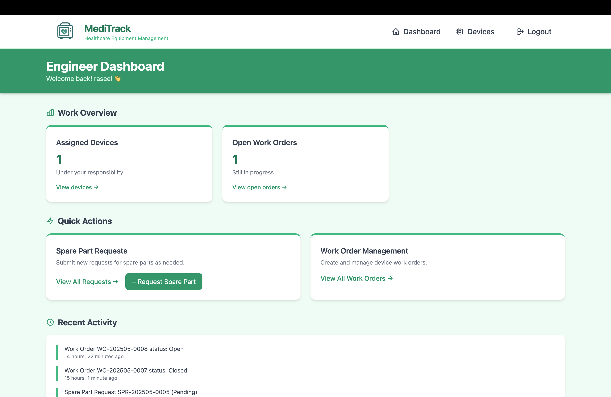
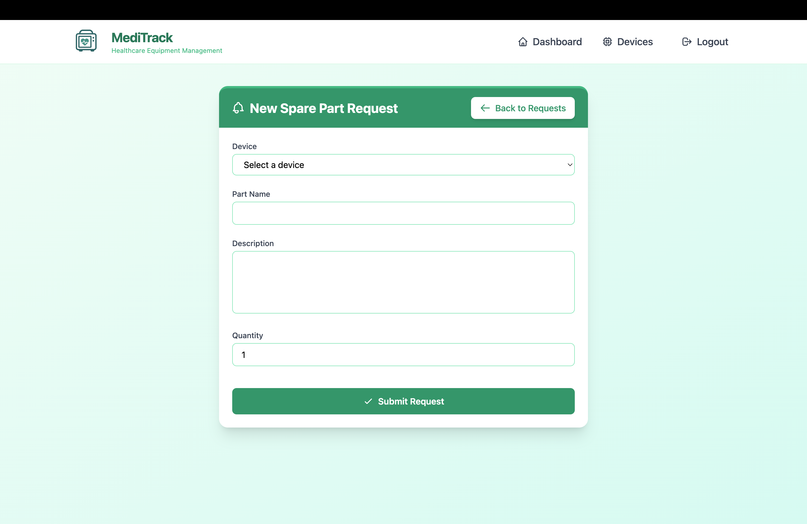
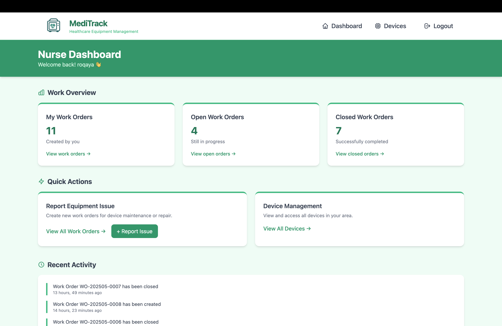
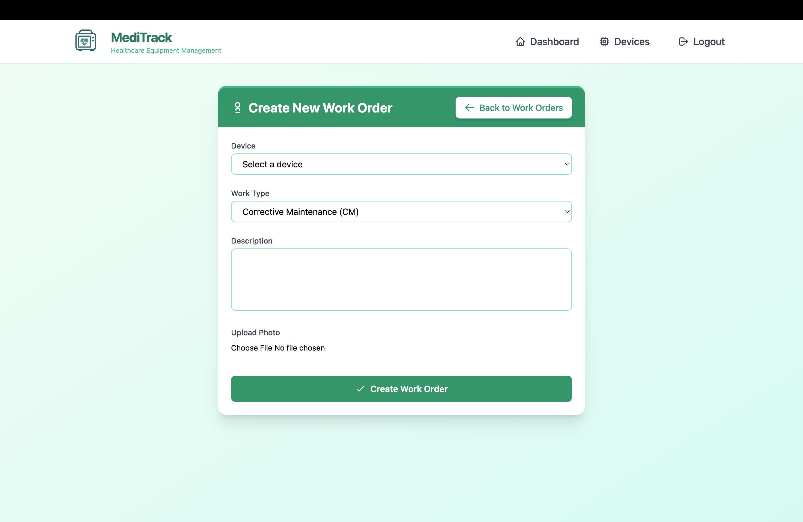

# MediTrack Frontend

## 🌟 Project Description

MediTrack is a full-stack web application designed to streamline the management of medical devices and maintenance work orders in a hospital environment. The frontend is built with React and TailwindCSS, delivering a responsive, intuitive user interface for three user roles: Admin, Nurse, and Engineer.

## 🔹 Repository Description

This repository contains the React frontend codebase for MediTrack, implementing JWT-based authentication, role-specific dashboards, and full CRUD operations for medical devices, hospitals, and rooms.

## 🤖 Live Link

http://localhost:5173/signup

## 🔗 Backend Repository

https://github.com/Rseelalshohail/MediTrack_backend

## 🌐 Tech Stack

- React  
- TailwindCSS  
- React Router  
- Context API   
- JWT Auth 

## 📚 Installation Instructions

```bash
# Clone the repo
$ git clone <MediTrack_backend>
$ cd <MediTrack_backend>

# Install dependencies
$ npm install

# Start the development server
$ npm run dev
```

**If using Docker:**

```bash
$ docker compose up --build
```

## Frontend Routing (React Router)

| Path                   | Component/Page             | Description                                         | Access Control      |
| :--------------------- | :------------------------- | :-------------------------------------------------- | :------------------ |
| `/login`               | `LoginPage`                | User login form                                     | Public              |
| `/signup`              | `SignupPage`               | User registration form                              | Public              |
| `/`                    | `Dashboard` / Redirector   | Main dashboard after login, redirects based on role | Authenticated       |
| `/devices`             | `DeviceListPage`           | Display list of devices (view depends on role)      | Authenticated       |
| `/devices/new`         | `DeviceCreatePage`         | Form to create a new device                         | Admin               |
| `/devices/:id`         | `DeviceDetailPage`         | Display details of a specific device                | Authenticated       |
| `/devices/:id/edit`    | `DeviceEditPage`           | Form to edit a specific device                      | Admin, Engineer     |
| `/devices/:id/inventory`| `DeviceInventoryPage`      | Form to update device location during inventory     | Engineer            |
| `/workorders`          | `WorkOrderListPage`        | Display list of work orders (view depends on role)  | Authenticated       |
| `/workorders/new`      | `WorkOrderCreatePage`      | Form to create a new work order                     | Engineer, Nurse     |
| `/workorders/:id`      | `WorkOrderDetailPage`      | Display details of a specific work order            | Authenticated       |
| `/workorders/:id/edit` | `WorkOrderEditPage`        | Form to update work order status, etc.              | Admin, Engineer, Nurse |
| `/spareparts`          | `SparePartListPage`        | Display list of spare part requests                 | Admin, Engineer     |
| `/spareparts/new`      | `SparePartCreatePage`      | Form to create a new spare part request             | Engineer            |
| `/spareparts/:id`      | `SparePartDetailPage`      | Display details of a specific spare part request    | Admin, Engineer     |
| `/profile`             | `ProfilePage`              | View/edit user profile                              | Authenticated       |
| `/admin/users`         | `UserManagementPage`       | (Optional) Manage users                             | Admin               |
| `/*`                   | `NotFoundPage`             | Displayed for any undefined routes                  | Public              |

## User Stories (Included in Implementation Plan):
- As an Admin, I want to log in to the system.
- As an Admin, I want to add, view, edit, and delete medical devices.
- As an Admin, I want to view all work orders.
- As an Admin, I want to view all spare part requests.
- As an Engineer, I want to log in to the system.
- As an Engineer, I want to view devices assigned to me.
- As an Engineer, I want to update the status of my work orders.
- As an Engineer, I want to request spare parts for a device.
- As a Nurse, I want to log in to the system.
- As a Nurse, I want to view devices assigned to me.
- As a Nurse, I want to create a work order for a device.
- As a Nurse, I want to view work orders created by me.

## 🔍 Web UI Screenshots
**Sign up page**

**Login page**

**Admin Dashboard**

**Engineer Dashboard**

**Spare part request form**

**Nurse Dashboard**

**Create new work order form**


## 🧋 IceBox Features

- Email reminders for overdue work orders  
- Multi-language support
- Work order priority levels
- Ability to export PDF reports for work orders  
- Dark mode toggle